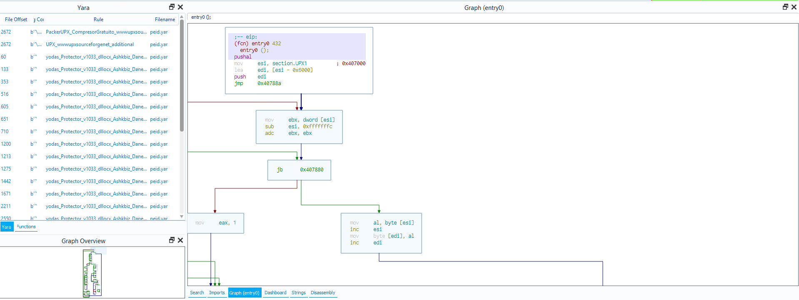

# Yara Cutter Plugin


## About 

Extension to use [YARA](https://github.com/VirusTotal/yara) rules on [Cutter](https://github.com/radareorg/cutter) projects.  
Simply paste your rule files in the "rules" directory to apply them at start.  



## Installation

This plugin relies on [yara-python](https://github.com/VirusTotal/yara-python).  
To make it work you need to install it into the cutter embedded python version.  

- For windows systems you can run the provided powershell file. (Don't forget to edit the path!)
- For nix operating systems simply install yara-python, locate the files with ```pip show``` and copy the module files to the python directory of cutter.
- Now copy the cutter plugin files to the cutter plugin directory (on windows usually found at ```%USERPROFILE%\AppData\Roaming\RadareOrg\Cutter\plugins\python\```)
- Finally add some rules to the "rules" directory

### Example Usecases

- [Packer detection](https://github.com/Yara-Rules/rules/blob/master/Packers_index.yar)
Detect matching packers to replace tools like PEiD or DiE.
- [Malware attribution](https://github.com/Yara-Rules/rules/blob/master/malware_index.yar)
Detect known malware signatures.
- [Crypto detection](https://github.com/Yara-Rules/rules/blob/master/Crypto_index.yar)
Detect various crypto constants.